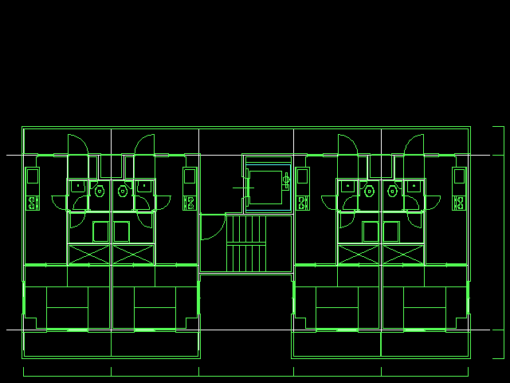
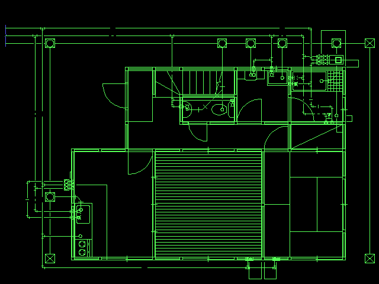
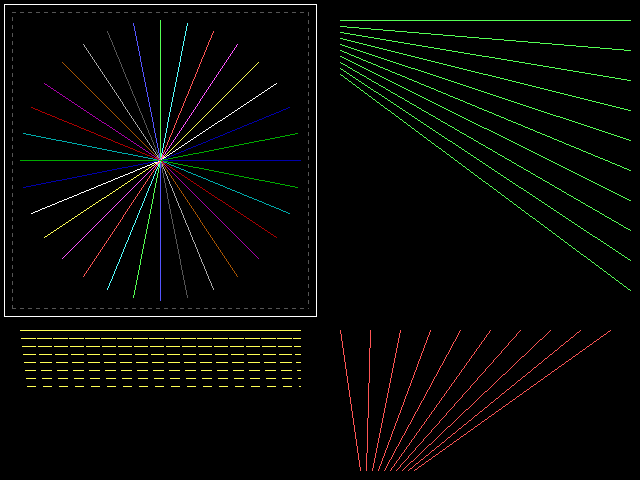

# JW_CAD for DOS/V — 解析と C 移植

DOS/V 用の 2 次元 CAD **ＪＷ＿ＣＡＤ version 2.22h**（jw_software club、1991-1996）を、
実行ファイルを Ghidra で逆コンパイルして解析し、C 言語に書き直して
最終的に WASM で動かすためのリポジトリです。

進め方は [super_depth_wasm](https://github.com/yomei-o/super_depth_wasm) と同じ
——逆コンパイル出力と 1 行ずつ突き合わせて C に書き直し、ネイティブと WASM の
両方を同じソースから作り、ウィンドウを開かずに検証する——ですが、規模が違います。
Super Depth は 70,731 バイト・239 関数でした。JW_CAD は **1,451,937 バイト**、
うち 1.2 MB がオーバーレイです。なので段階的に進めます。

**遊ぶ（見る）: https://yomei-o.github.io/jwcad_dos_wasm/**

同梱の図面をブラウザで開いて、拡大縮小と移動ができます。メニューも押せます
（一文字キーでも選べます）。**作図コマンドが 26 個動きます**——＋ ／ □ ○
「（」複線 線消 点 消去 線変更 文字 複写 移動 線伸縮 線切断 コーナー連結
面取 ２線 中心線 分割 正多角形 測定 寸法 ハッチ 円線接 曲線⑦連線 文編集 ■拡大■。
引いた図面は**保存**できて、本物のＪＷ＿ＣＡＤ がそれを
開いて同じ画面を描くところまで確かめてあります。
**画面の左の盤も本物と同じように押せます**——ペン・紙・縮尺・図面名・
ｸﾞﾙｰﾌﾟ・レイヤ 16 個・サブ画面表示・目盛、それに帯の 電卓。
**プロッタ出力から PDF と PNG が出せます**（帯の釦か、本物と同じ
入出力 → ②プロッタ → ③ﾌｧｲﾙ出力 の道筋で）。
**文字コマンドでは日本語も打てます**——ブラウザ（OS）の入力メソッドで変換して
確定すると、DOS/V の FEP がしていたのと同じ Shift-JIS のバイトが届きます。
**右ボタンの読取は修飾キーにも応えます**——[SHIFT] で線・円の上の点、
[GRPH] で中心点と 2 点間の中心、[CTRL] で円周の 1/4 点。
読み込みも描画も移植した C で、画面は当時と同じ 640×480 16 色
（VGA モード 12h）の 4 プレーンをそのまま展開しています。

**いまできていること: 画面と、図面の読み書きと、作図コマンド 26 個と、読取と、
日本語入力と、左の盤ぜんぶと、プロッタ出力（PDF／PNG）。**
ルート 618 関数とオーバーレイ 36 本（コードの 89.6%）を逆コンパイルし、
VGA のグラフィックコントローラ・線・円弧・文字を C に移し、`.JWC` の形を解いて
同梱の図面 14 枚すべてを読めるようにし、**まわりの画面（メニュー・レイヤ釦・
下の帯・矢印）も本物の呼び出しを読んで作りました**。

本物を DOS/V エミュレータで走らせた画面と突き合わせると:

| | |
|---|---|
| 図面なしの起動画面 | **0 画素差** |
| 図面 14 枚（640×480 まるごと） | 13 枚が **0 画素差**、TEST7 だけ 6 |
| メニュー 30 項目を押したあと | 28 項目が **0 画素差**、残り 2 項目が 1 画素ずつ |
| ／ □ ○ （ で引いたあと | **0 画素差** |
| 点を取った直後（ポインタが動く前） | **0 画素差** |
| 線変更 でペン・線種・レイヤを変えたあと | **0 画素差**（レコードも本物と 1 バイト同じ） |
| 文字 を打ち込んで書いたあと | **0 画素差**（レコードも文字列プールも本物と 1 バイト同じ） |
| 複線（間隔を打つ／[F1]〜[F5]／②連続／①間隔取得）| **0 画素差** |
| 保存したファイルを本物に開かせる | **0 画素差**（14 枚とも読んで書いて 1 バイトも違わない） |
| 消去の 追加･除外 が拾う実体 | **本物と同じ番号**（質問図面 13 点・SAMPLE0 5 点・SAMPLE6 44 点） |
| 消去の 追加･除外（線・円(L)、文字(R)、[F2]） | **0 画素差** |
| 消去の ②範囲外消去（切り取り消去） | **0 画素差**（またぐ線を押した 2 画素だけ描き順） |
| 複写・移動（範囲・①ﾏｳｽ位置・②数値位置・③連続） | **0 画素差**（本物の `(0,16)` 1 画素と、消しが隣を巻き込む分を除く） |
| 修飾キーの読取が取る点（[SHIFT] [GRPH]） | **本物と同じ点**（11 件、mm 3 桁まで） |
| キーを押している間の盤面の言葉（3 キー × 11 命令） | **0 画素差** |
| 2 回目の押しを待っている画面（【線･円上点スナップ】ほか） | **0 画素差** |
| [CTRL] の円周1/4点（4 方向・□○（点・弧と円） | **0 画素差** |
| 寸法（①横方向・②縦方向）・ハッチ・円線接・曲線⑦連線・文編集 | **0 画素差** |
| 左の盤（ペン・紙・縮尺・図面名・ｸﾞﾙｰﾌﾟ・レイヤ 16・サブ画面表示・目盛） | **0 画素差** |
| グループ／レイヤ データ表示（4×4 の一覧） | **0 画素差**（SAMPLE0 だけ 10） |
| 数え箱の 目盛／軸角 の盤（指すと出る）とメニューの反転 | **0 画素差** |
| 帯の 電卓・■拡大■・前倍率・倍率指定 | **0 画素差** |
| 入出力 → ①ファイル／②プロッタ のメニュー | **0 画素差** |
| プロッタ出力の線（本物のプロッタ出力と 1 本ずつ） | **一致**（SAMPLE0 11 本、TEST5 40 本） |

### プロッタ出力 —— PDF と PNG

帯の **PDF** ／ **PNG** を押すか、本物と同じ道筋
（**入出力** → **②プロッタ** → **③ﾌｧｲﾙ出力** → 名前を打って [Enter] →
**①確定** → **① 実行**）で書き出せます。用紙は描かれた中身に合わせます
（周囲 10mm）。日本語は PDF 自身の CJK フォント（90ms-RKSJ-H）に渡すので
フォントを埋め込みません。

正しさは**本物のプロッタ出力と突き合わせて**確かめました
（`tools/plotcmp.py`）。本物を DOS/V エミュレータで
入出力 → ②プロッタ → ③ﾌｧｲﾙ出力 まで動かして書かせたファイルと、移植が
歩いた線を 1 本ずつ比べて、円弧のない図面なら**本数も座標も一致**します
（SAMPLE0 11 本、TEST5 40 本）。本物が出すのは「表示されている線だけ、
点は出さない」で、移植の判定と同じでした。

### ひととおり通してみる

```sh
node tools/flowcheck.mjs orig/SAMPLE1.JWC
```

**1 つの走行**で、図面を開く → ／ で線を 1 本引く → 保存 → 保存したものを
開き直す → 入出力 ②ﾌﾟﾛｯﾀ ③ﾌｧｲﾙ出力 ① 実行 → PDF と PNG、まで通します。
部品ごとの検査はどれも新しい状態から始めるので、続けて使ったときに
成り立つかは言えませんでした。

最初に引く 1 本が効きます——**保存した図面は開いたものより線が 1 本多く、
PDF は元の PDF より線分が 1 つ多くなければいけません**。読み込んだままの
図面を黙って出力する鎖は、ほかのどの検査も通ってしまいます。

```
  ok   saved with the line that was drawn (762 -> 763 lines)
  ok   and the line that was drawn is in it (2294 -> 2295 segments)
```

PDF と PNG は**書いた側とは別の読み手**で読み直します
（`tools/pdfread.mjs` `tools/pngread.mjs`）。前者はビューアと同じに
`startxref` から相互参照表を辿り、各行が本当にそのオブジェクトを指すか、
`/Length` が実長ちょうどか、`/Root` からページに届くか、文字が使う
フォントがページの資源にあるかを見ます。後者は全チャンクの CRC を検算し、
**node の zlib で**（こちらが書いた deflate ではなく）展開して行フィルタを
戻し、背景でない画素を数えます。「`%PDF` で始まって `%%EOF` で終わる」では、
同じデータを 2 度出していたときの PNG も通っていました。

まだ無いのは **変形・図形・ｵﾌﾟｼｮﾝ**（外部データを読む大きな仕組み）と、
入出力のファイル操作、寸法・曲線・円線接 の残りの枝、帯の HELP です。
続きの作業に入る人は [RESUME.md](RESUME.md) の冒頭「引き継ぎ」から読んでください。

## ビルドと検証

```sh
sh tools/check.sh          # 全部。ビルド、単体検査、図面 14 枚、ネイティブ対 WASM
sh tools/build_tests.sh    # ネイティブ側だけ
sh tools/build_wasm.sh     # jwcad.js / jwcad.wasm
```

`tools/check.sh` の最後は**ネイティブと WASM の画面を 1 画素ずつ突き合わせます**。
両方が同じ `src/*.c` を通るので、差が出たらそれは移植が環境に依存した印です。

```
=== native against WASM, pixel for pixel
  same   orig/SAMPLE1.JWC
  same   orig/SAMPLE2.JWC
  ...
```

## 対象

`orig/jwcv222h.lzh` がオリジナルの配布アーカイブです。展開済みのファイルも
`orig/` に置いてあります（全 60 ファイル、CRC 一致）。

| ファイル | サイズ | 中身 |
|---|---|---|
| `JW_CADV.EXE` | 1,451,937 | 本体。DOS MZ / 16bit リアルモード、Microsoft C 6.0 |
| `JW_CADV.HLP` | 144,019 | ヘルプ |
| `JW_OPT*.DAT` | 22 本 | 建具などのパラメトリック図形ライブラリ。テキスト（`#建具一般平面図` に線分の並びが続く） |
| `JW_PAL.DAT` `JW_PAL.WB` | 160 | パレット |
| `DXF_HDR.DAT` | 1,535 | DXF 出力のヘッダ雛形 |
| `SAMPLE*.JWC` `TEST*.JWC` | | 図面のサンプル 13 枚 |
| `SAMPLE.JWF` `SAMPLE.JWL` `SAMPLE.JWP` | | 設定・線種・プロッタ |
| `KEISAN*.JWM` | | 計算マクロ |
| `SETUP_V.EXE` `JW_SAMPL.EXE` | | インストーラとサンプル集 |
| `README_V.DOC` `JW_CAD.DOC` `JW_VER.DOC` `JW_MNU.DOC` `JWP.DOC` | | 添付ドキュメント |

添付ドキュメントによると、DOS のマウスドライバ (`MOUSE.COM`) が必須、
画面は VGA のビデオモード `12h`（640×480 16 色）が既定で、起動オプション
`-Vnn` で変えられます（`-V6a` で SVGA 800×600、ただし FEP が使えなくなる）。

## わかっていること

### JW_CADV.EXE は EXEPACK で圧縮されている

MZ ヘッダが「再配置 0 個」と言っているのに 7000 個の far 参照があるはずの
マルチセグメントのプログラム、という矛盾が入口でした。エントリ
（`cs:ip = 34ab:0010`）にあるのは Microsoft **EXEPACK** の展開スタブで、
`0xb0` / `0xb2` の後ろ向き RLE と、そのあとの再配置表の再生をやっています。

```
署名          "RB"  (スタブ先頭 +0x0e、16 バイト版ヘッダ)
本当の CS:IP  22b2:38b9        本当の SS:SP  3fe8:2ee0
展開後        255,088 バイト   再配置        7,019 個（スタブ +0x132 から）
```

`+0x132` はスタブの `mov si, 0x132` がそのまま指している位置で、
総当りで見つけた位置と一致します。

**`python tools/unexepack.py orig/JW_CADV.EXE decomp/JW_CADV.unp.exe`**

展開後の EXE はそのまま動く形にしてあります（オーバーレイの連鎖が
512 バイト境界から始まるよう詰め物を入れ直しているので、36 個全部が
解凍後のファイルからも辿れます）。DOSBox で原典の挙動を確かめるときの基準です。

### オーバーレイは 36 個、全部が同じ場所に載る

ルートの後ろに **36 個のオーバーレイ**が並んでいます。1 個ずつが独立した MZ で、
自分の再配置表を持ち、512 バイト境界に整列しています。

```
0x000000  ルート（EXEPACK 圧縮、展開後 255,088 B）
0x038600  オーバーレイ 1    43,170 B
0x043000  オーバーレイ 2    33,195 B
   ...
0x15a000  オーバーレイ 36   34,721 B     計 1,211,250 B
```

呼び出しは `INT 3Fh` の 4 バイトのトラップで、ファイル全体に 532 箇所
（ルートに 97、残りはオーバーレイどうし）あります。

```
cd 3f 1c f4 0e     INT 3Fh / オーバーレイ 0x1c / その中のオフセット 0x0ef4
```

管理表はルートの DGROUP（`ds = 0x3375`）にあります。

| | |
|---|---|
| `DS:0x8ee4` | オーバーレイごとの word ＝ ロード先セグメント。**全部 0x2ab8** |
| `DS:0x8f2e` | オーバーレイごとの byte ＝ 領域番号（いまは恒等） |
| `DS:0x8f53` | オーバーレイごとの dword ＝ ファイル位置。**BSS にあり、起動時に埋まる** |
| `DS:0x837c` | 呼び出しスタック（5 バイト × 最大 0x80、段数は `DS:0x8366`） |
| `DS:0x8fe7` | `"jw_cadv.exe"` —— 自分自身を開いて読む |

`DS:0x8f53` が実行ファイルの中では空なのが大事なところで、マネージャは起動時に
自分の MZ ヘッダからルートの末尾を出し、そこから MZ ヘッダの連鎖を歩いて
表を埋めます。**リンク時の絶対位置をどこにも持っていないので、ルートを
EXEPACK で縮めてもオーバーレイが壊れない。** 圧縮してあるのに動く理由がこれです。

ロード先が全部 `0x2ab8` ということは、**常駐できるのは 1 個だけ**です。
その読みが正しい決め手はサイズで——

| | |
|---|---|
| 最大のオーバーレイのロードイメージ | 35,783 バイト |
| オーバーレイの穴 `(0x3375 - 0x2ab8) × 16` | 35,792 バイト |

リンカが穴を最大のオーバーレイちょうどに合わせた跡が、9 バイトの余りとして残っています。

**`python tools/overlays.py --merge`** が、解析用に 36 個の MZ を作ります。
オーバーレイ単体は Ghidra に食わせても意味がありません（ルートを呼び返すし
DGROUP を読む）。なので 1 個ずつ「展開済みルートの穴にそのオーバーレイを
落とし込み、再配置表を両方まとめた完全な MZ」にしてあります。

### 文字列はぜんぶルートにある

オーバーレイ側は実質コードだけで、文字列は 36 個ともほぼゼロです。
ルートの DGROUP（44,320 バイト）に **2,340 本**が固まっていて、
そこに UI が全部あります。

```
複 写 / 複 線 / 面 取 / ２ 線 / 線 消 / 文 字 / 寸 法 / 測 定 / 移　動 / 変　形 /
ハッチ / 多角形 / 中心線 / 分　割 / 仮実点 / 曲　線 / 線変更 / 消　去 / 円線接 /
図  形 / 文編集 / 入出力
```

`"jw_cad(c)data......."` が図面ファイルの署名、`"ZUKEI_1_"` が図形ファイル、
`"LAYNAM_%x=%s"` がレイヤ名の書式、といった具合に、ファイル形式の手がかりも
ここに揃っています。

### 36 個のオーバーレイが何担当か

オーバーレイの中には文字列が無いので、「どれが何か」はバイト列を見ても分かりません。
でも、コードは DGROUP の文字列を使うときにそのオフセットを即値で積むので、
**どの文字列に手を伸ばしているか**を数えると分かります（`tools/ovlmap.py`）。

```sh
python tools/ovlmap.py           # 各オーバーレイの上位だけ
python tools/ovlmap.py 28        # 28 番が触る文字列を全部
python tools/ovlmap.py --callers # どこから呼ばれているか
```

| | 担当 | 決め手になった文字列 |
|---|---|---|
| 1 | 属性変更 | `書込用` `線色` `線種` ` に変更` `AUTO.JWC` |
| 2 | コーナー連結・線伸縮・線切断 | `◇コーナー連結 対象線･弧` `線端点移動` `線伸縮` |
| 3 | DXF 入出力 | `DXFOUT` `dxf_hdr.dat` `ltype.dxf` `2.5D データ` |
| 4 | 面取 | `面取` ` 内角面取【` `(A),(B)辺` `偏平率` |
| 5 | 測定 | `線･円･文字` `計算中です（[ESC] で中止）` |
| 6 | 外部変形・図形ファイル選択 | `.COM` `.EXE` `%s\ZU_NAME.DAT` `図形【%s】` |
| 7 | 中心線・間隔取得 | `同一線上点` `間隔取得` `点指示 or 間隔=` |
| 8 | ファイル操作と角度入力 | `新規` `保存\|` `任意角度` `0 度 ﾏｳｽ` `円上点` |
| 9 | ハッチ | `ハッチ枠の` `(L)開始線 (R)単独円` `\|①自動選択(左回)\|` |
| 10 | ペイント | `ペイント` `作図処理中  中断=[ESC]` |
| 11 | 座標の読み書き | `jwc_temp.txt` `円弧データです` `基準点` |
| 12 | AUTO モードと状態表示 | `AUTO ﾓｰﾄﾞ (L)free:＋／ , 線:線編集` `Ｇrp` `Ｌay` |
| 13 | 円線接（接する弧・線） | `第１の弧` `接する弧･線 指定` `弧反転` |
| 14 | 線切断・部分消去 | `線切断` `部分消去` `円弧 %s（左回り）の` |
| 15 | 文字作図 | ` ﾍﾟﾝ%d 基点 %s ` `ずれ位置` `ペン（色）1～7` |
| 16 | 建具など図形ライブラリ | `%sJW_OPT` `.DAT` `種類` `【%c】変更\|` |
| 17 | 自動保存 | `自動保存` `\|保存間隔\| ` `%ld秒` |
| 18 | プロッタ出力 | `プロッタ出力に失敗しました。` `jw_repl.dat` `Pen[%d]` |
| 19 | プロッタ定義の読み込み | `INIT1` `wait` `INIT2` `P_SIZE` `jwp_err.tag` |
| 20 | 分割 | `分割` `距離` `四捨五入` `始点` `からの` |
| 21 | 印刷設定 | `破 線` `\|鎖 線 \|線太\|出力倍率\|余白\|` |
| 22 | レイヤ／縮尺／用紙と電卓 | `用紙 サイズ (A0～A4） 変更` `%s %s縮尺 変更` |
| 23 | 寸法（平行線・矢印） | `寸法 = ` `任意寸法 ﾏｳｽ(L)` `矢印` |
| 24 | 接線 | `接線` `円～円間` `円周点` `（接線通過位置）` |
| 25 | 接円（半径指定） | `変更半径=` `接円選択＝マウス移動` |
| 26 | 接円（３点・２点と１線など） | `３点` `２点と１` `の接円  ` |
| 27 | 寸法（引出し線・円径／円周／角度） | `引出し線の始点` `● 寸法線 位置` `\|円径(L) \|円周(R) \|角度 \|` |
| 28 | 起動・バージョン・ＥＭＳ | `JW_CADV version 2.22H` `Copyright (c) jw_software club` `EMS:%d,%d pages` |
| 29 | 文字種類と測定結果 | ` ﾍﾟﾝ%d 残文%5d ` `◇結果表示   小数点位置` |
| 30 | 角度（２点間角度） | `1ﾟ毎` `5ﾟ毎` `②２点間角度\|` |
| 31 | 図形登録 | `ZUKEI_1_` `ZUKEI_%d_` `図形%s 登録できません` |
| 32 | 文字の書き出しと外部エディタ | `外部編集` `文書出` `jwc_temp.000` |
| 33 | 壁面日影 | `壁面日影` `建物 %s   （点%4d  辺     ）` `壁面線が建物通過` |
| 34 | 日影図 | `日 影 図 作 図 中` `測定間隔` `JW_FILE0.000` |
| 35 | ２.５Ｄ（高さ・奥行） | `ﾚｲﾔｸﾞﾙｰﾌﾟ[%c]高さ =` `線･円の高さ奥行` |
| 36 | 図面ファイルの読み書き | `jw_cad(c)data.......` `%lp,%lp` `jw_prof.000` `J___TREE.DAT` |

バイト列から当てた推測なので、手がかりであって断定ではありません。
ただ 28 番だけは裏が取れていて、`main` が呼ぶ 8 回のオーバーレイ呼び出しのうち
6 回が 28 番です（`python tools/ovlmap.py --callers`）。起動まわりで合っています。

なお、実行ファイルが名乗るのは **version 2.22H**（`Copyright (c) jw_software club 1991-1999`）です。
同梱の `README_V.DOC` は 2.02 と書いていますが、そちらが古いままのようです。

### そのほか

* コードは 16bit リアルモードのみ。DOS エクステンダ（DPMI / X-32 / DOS/4GW）は使っていません
* Microsoft C 6.0 のランタイム文字列 (`MS Run-Time Library - Copyright (c) 1990, Microsoft Corp`)
* **フォントは持っていません。** 字形は DOS/V のフォント API
  （`INT 15h AX=5000h`）で取得ルーチンのアドレスをもらって呼び出します。
  なので移植側はフォントを自前で用意する必要があります
* **BIOS は `int86()` 経由なので、機械語に `INT` 命令が出てきません。**
  `cd 10` や `cd 33` を探しても一つも見つからず、最初はマウスも EMS も
  使っていないと読み違えました。実際には `INT 10h`（画面）・`INT 33h`（マウス）・
  **`INT 67h`（EMS。図面データは拡張メモリに置かれています）**・
  `INT 17h`（プリンタ）を使っています。詳しくは [RESUME.md](RESUME.md) の「画面」に

## ツール

**`tools/lzh.py`** — LZH の展開。ここには lha も 7z も入っていないので、
super_depth_wasm から持ってきました。ヘッダレベル 0/1/2、`-lh0-` 〜 `-lh7-`。

```sh
python tools/lzh.py orig/jwcv222h.lzh          # 一覧（CRC 検査つき）
python tools/lzh.py orig/jwcv222h.lzh orig     # 展開
```

**`tools/unexepack.py`** — Microsoft EXEPACK の展開。上のとおり。

**`tools/overlays.py`** — オーバーレイの連鎖を歩いて、一覧・切り出し・
Ghidra 用の結合イメージ作成。

```sh
python tools/overlays.py            # 一覧
python tools/overlays.py --split    # decomp/ovl/ovlNN.bin（生イメージ）
python tools/overlays.py --merge    # decomp/ovl/jwNN.exe（ルート＋1 個）
```

**`tools/disasm.py`** — 展開済みイメージの一部を 16bit で逆アセンブル（capstone）。
`INT 21h` / `INT 10h` / `INT 33h` の機能名、`INT 3Fh` のオーバーレイ番号、
DGROUP の文字列、VGA のポートを注釈します。

```sh
python tools/disasm.py 0x26147 0x90     # イメージ先頭からのオフセット
python tools/disasm.py 3375:8f53 0x40   # seg:off
```

**`tools/callsites.py`** — ある番地への呼び出しを全部見つけて、そこで積まれた
引数を機械語から復元。Ghidra の 16bit 出力は引数をローカル変数に化けさせるので、
これが無いと引数の個数すら確かめられません。near / far / `INT 3Fh` の 3 種類とも
探します。`push cs` ＋ near call で far 呼び出しを合成する MSC の手口も込みです。

```sh
python tools/callsites.py 10a9:0732
#   root    010c01  far    pushed: [bp+18], 0x0000
#   root    011263  near   pushed: (cs), [bp+14], [bp+16]
```

**`tools/func.py`** — `decomp/*/all.c` から関数を 1 本取り出す。

```sh
python tools/func.py 1000:0446    # main
python tools/func.py 20a9         # そのセグメントの関数一覧
```

**`tools/ovlmap.py`** — 各オーバーレイが触る DGROUP の文字列を数えて、
何担当かを当てる。上の表はこれで作りました。

**`tools/ghidra.sh`** — Ghidra headless で逆コンパイルして `decomp/` に出す。

```sh
sh tools/ghidra.sh root      # ルート
sh tools/ghidra.sh 07        # オーバーレイ 7（ルート込み）
sh tools/ghidra.sh all       # 全部（長い）
```

**`tools/lowpri.sh`** — 長い仕事を低優先度で走らせるラッパ。Ghidra もこれ経由です。

## 図面が読めて描ける

`orig/SAMPLE2.JWC` と `orig/SAMPLE6.JWC` を、移植したコードだけで描いたものです
（`src/jwc.c` が読み、`src/draw.c` が `src/vga.c` のグラフィックコントローラ越しに描く）。
線・円弧・文字まで移植した描画で出しています。漢字は東雲フォント
（パブリックドメイン）を FONTX2 に変換して同梱したもので、**原典自身は
フォントを持たず DOS/V から借りています**（`INT 15h AX=5000h`）。




```sh
sh tools/build_tests.sh
./tests/drawing.exe orig/SAMPLE2.JWC tmp/sample2.png
```

### `.JWC` の形

先頭に 200 バイト固定のテキストが 4 行、そのあとは**メモリ上の構造がそのまま**入っています。

```
0x0000  署名 "jw_cad(c)data......." と図面名
0x00c8  個数と設定        ← DGROUP 0x0d7a の "%li,%li,%i,%i,..."
0x0190  設定のつづき      ← DGROUP 0x0e28
0x0258  far ポインタ 2 本 ← DGROUP 0x0dde の "%lp,%lp"
0x0320  データ本体
```

2 行目の先頭 4 つが個数で、これが鍵でした。ただし**プログラム自身が出す
順番とは違います** —— ステータス行は `線=%ld 円=%ld 点=%d 文字列=%d`
（DGROUP 0x022e）ですが、ファイルでは**文字列が点より先**です。

```
線, 円弧, 文字, 点
```

データもその順に、ただの配列として並びます。

| | 大きさ | 中身 |
|---|---|---|
| 線 | 22 | `float x0,y0,x1,y1` ＋ `pen, type` ＋ 4 |
| 円弧 | 32 | `float cx,cy,r` ＋ 扁平率 ＋ 開始/終了角 ＋ 傾き ＋ `pen, type` ＋ 4 |
| 文字 | 24 | `float x0,y0,x1,y1`（ベースライン）＋ 文字列プールへの far ポインタ ＋ 4 |
| プール | | NUL 区切りの Shift-JIS。長さは 4 行目の**2 本目**のポインタのオフセット |
| 点 | 12 | `float x,y` ＋ 4 |

円弧の中身はこうです。

```
float cx, cy, r;         12   中心と半径
short flatten;            2   短径/長径 x10000。10000 が真円、1000〜8679 が楕円
short ?;                  2   ほとんど 0
short start, start_frac;  4   開始角（度）と端数
short end, end_frac;      4   終了角。start と同じなら全周
short tilt;               2   楕円の傾き（度）
byte  pen, type;          2   線レコードと同じ属性
byte  rest[4];            4
```

`flatten` を 32 ビットで読むと後ろのフィールドを巻き込んで、それが 0 でない
レコード（`SAMPLE2.JWC` では 98 本中 33 本）で 10000 が桁違いの数に化けます。
画面いっぱいが塗りつぶされて気づきました。

**形が閉じている決め手**は、点セクションの終わりがファイルのデータ末尾と
ぴったり一致することです。どれか一つでもレコード長を間違えると合いません。
なので開始位置は「末尾 − 個数から出る総量」で決まり、
`tests/jwc_test.exe` が同梱の 14 枚すべてでそれを確かめます。

まだ分かっていないのは**データ本体の手前にある可変長の前置き**です
（バイト列からはレイヤ表に見えます）。14 枚中 13 枚で 1,589 バイト、
`SAMPLE2.JWC` だけ 1,621 でした。

## いまの画面

`src/draw.c` に移した線描画が出した絵です（`./tests/screen.exe`）。
32 本の放射線で両方の Bresenham を、8 段階の破線で線種を、
一番下の `ROP_XOR` を 2 回かけた線で「跡形もなく消える」ことを見ています
——ラバーバンドの前提です。



## これから

1. ~~アーカイブの展開~~ 済 — `tools/lzh.py`
2. ~~EXEPACK の展開~~ 済 — `tools/unexepack.py`
3. ~~オーバーレイ構造の解明~~ 済 — 36 個、`tools/overlays.py`
4. ~~Ghidra で全体を逆コンパイル~~ 済 — ルート 618 関数、オーバーレイ 89.6%
5. ~~36 本それぞれの担当~~ 済 — `tools/ovlmap.py`、上の表
6. ~~画面~~ 済 — `src/vga.c`（グラフィックコントローラ）、`src/draw.c`（線・円弧・文字）
7. ~~図面ファイル `.JWC`~~ 済 — 同梱の 14 枚すべて読める
8. ~~文字~~ 済 — DOS/V のフォント API を特定し、東雲フォントを同梱
9. ~~ブラウザで動かす~~ 済 — ネイティブと 1 画素まで一致
10. ~~DOS/V エミュレータを正解にした画面比較~~ 済 — `tools/check.sh`（下記）
11. ~~入力 —— マウスとキーボード~~ 済 — 押し・一文字キー・数値入力・文字入力
12. ~~図面を書き戻す~~ 済 — `jwc_save()`。14 枚が読んで書いて 1 バイトも違わない
13. ~~右ボタンの読取と修飾キー~~ 済 — [SHIFT] [GRPH] [CTRL] とも本物と同じ点
14. ~~日本語入力~~ 済 — ブラウザの入力メソッドから Shift-JIS で届く
15. ~~画面左の盤~~ 済 — ペン・紙・縮尺・図面名・ｸﾞﾙｰﾌﾟ・レイヤ 16 個・
    サブ画面表示・目盛・データ表示、それに帯の 電卓
16. ~~PDF／PNG 出力~~ 済 — [dosbox_wasm](https://github.com/yomei-o/dosbox_wasm)
    と同じように。本物のプロッタ出力と線を 1 本ずつ突き合わせて確かめました
17. **作図コマンドを 1 つずつ** —— いま 26 個。残りは
    変形・図形・ｵﾌﾟｼｮﾝ の 3 個と、入出力のファイル操作、
    寸法・曲線・円線接 の残りの枝

## 本物と突き合わせる —— 図面 14 枚のうち 13 枚が 1 画素も違いません

移植が正しいかは、最終的には**本物と同じ絵が出るか**でしか決まりません。
対になる [dosv_emu_cpp](https://github.com/yomei-o/dosv_emu_cpp) で本物の
`JW_CADV.EXE` を動かし、同じフォントと同じパレットを両方に与えて、
作図領域を 1 画素ずつ比べています。

```sh
sh tools/screens.sh          # 同梱の 14 枚ぶんを一度に
sh tools/kinds.sh SAMPLE6    # 線・円弧・文字・点に分けて
```

| | 差 | | | 差 |
|---|---|---|---|---|
| SAMPLE0 | **0** | | SAMPLE6 | **0** |
| SAMPLE1 | **0** | | TEST1 | **0** |
| SAMPLE2 | **0** | | TEST2 | **0** |
| SAMPLE3 | **0** | | TEST3 | **0** |
| SAMPLE4 | **0** | | TEST4 | **0** |
| SAMPLE5 | **0** | | TEST5 | **0** |
| | | | TEST6 | **0** |
| | | | TEST7 | 6 |
| | | | **合計** | **6** |

描いている画素は全部で 10 万を超えます。TEST7 に残る 6 画素は縦の文字枠
ひとつで、本物の三角関数の 1e-5 ほどの誤差が出ています。

ここには長いあいだ 101 画素あって、うち 95 を「本物の側の 64KB バグ」と
書いていました。**それは間違いで、エミュレータのバグでした**——`INT 21h` の
読み書きが転送先のオフセットを 16 ビットで足していたので、64KB をまたぐ
転送がセグメントの頭に巻き戻っていたのです。保存を作るときに、本物の
書いたファイルの途中に別のメモリが混ざっているのを見つけて分かりました。
どちらも [RESUME.md](RESUME.md) に書いてあります。

やりかたは 1 つだけです——**当てはめを探さない。本物の呼び出しを読む。**
`DOSEMU_WATCH` でその画素を書いた命令を出し、そのルーチンに `DOSEMU_BP` を
置いて渡っている値を読み、足りなければ本物に質問する図面を作る。
これで解けたものばかりで、当てて探した日はそのたびに外しています。

## メニューの枝も —— 284 通りのうち 276 が 1 画素も違いません

絵が同じでも、押したときに同じ画面が出なければ同じソフトではありません。
メニュー 30 個 × その命令が上の行に出すセル × 左右のボタン、**全 284 通り**を
本物と 1 画素ずつ比べています。

```sh
node tools/branchlist.mjs > tmp/branch/list.txt   # 枝の一覧を作る
sh   tools/branchorig.sh 1 284                    # 本物の画面
sh   tools/branchstr.sh  $(cat tmp/branch/all.txt) # 本物が書いた文字列
node tools/branchport.mjs 1 284                   # こちらの画面
python tools/branchdiff.py                        # 何画素違うか
```

本物は**起動 1 回で 284 通りを順に歩きます**（枝の間は [ESC] 2 回）。
こちらも同じように歩かせます。毎回作り直すと別のものを測ってしまうからです
——面取の【角面】【丸面】【Ｌ面】【楕円面】のように [ESC] では戻らない設定が
あり、「同じメニュー項目をもう一度選ぶ」のも選び直しではありません（変形は
変形範囲に進み、図形は自分の画面を出します）。

残っている 8 通りは:

| | 差 | なぜ |
|---|---|---|
| 図形 ⑦登録 ⑧複写 (4通り) | 648 | 一覧の先頭が `AUTO.JWC` で、その日付と大きさは**走らせた時刻そのもの**。本物は起動から 30 分ほどで図面をそこへ自動保存します |
| ｵﾌﾟｼｮﾝ ②断面 (2通り) | 58 | 円弧が 1 画素左。中心の半端の扱いがまだ本物と同じでない |
| ｵﾌﾟｼｮﾝ ③立面 (2通り) | 364 | 回転窓の斜線の丸め |

ｵﾌﾟｼｮﾝの建具の絵は、同梱の `JW_OPT1.DAT` などを読んで描いています。
**このファイルは平文で、末尾で自分の書式を自分で説明しています**——
記録は「線の端点ブロック番号 2 つと、それぞれのブロックの座標」で、だから
ブロックをまたぐ線だけが建具の内法寸法だけ伸びます。画面での置き方
（1 単位が何画素か、ブロックがどれだけ離れるか）はファイルに書いていないので、
本物の画面から測りました。

## 権利について

ＪＷ＿ＣＡＤ はもともと jw_software club（清水治郎・田中善文）が配布していた
フリーソフトです。`orig/` にオリジナルの配布アーカイブ `jwcv222h.lzh` と
その中身をそのまま入れてあります。著作権は作者にあります。
このリポジトリのツールと、これから書く C ソースは解析して書き直したものです。
